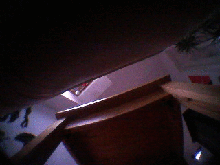

# PedroPatch

PedroPatch is a kernel driver module for the LG HomBot/Roboking VR6260 that allows to access the camera of this device.
(Its name stems from the fact that our robot friend is called "Pedro" because of his Spanish origins. And a patch is a small modification to a piece of software.)

## Using it
### Install the kernel module

transfer pedropatch.ko to the device

    HOST$ scp pedropatch.ko root@{HOMBOT IP}:/usr/test/

loading the module 

    HOMBOT$ insmod /usr/test/pedropatch.ko
    HOMBOT$ mknod /dev/camclone c 222 0

### Capture a single image

    HOMBOT$ dd if=/dev/camclone bs=153600 count=1 > /usr/tmp/img.yuv 

transfer the image to the HOST

     HOST$ root@{HOMBOT IP}:/usr/tmp/img.yuv .

convert the image to jpg

    HOST$ convert -size 320x240 -depth 8 -sampling-factor 4:2:2 -interlace plane img.yuv img.jpg

### Stream live video

    HOST$ nc -l 12345 | tee  img.yuv | vlc --demux rawvideo --rawvid-fps 15 --rawvid-width 320 --rawvid-height 240 --rawvid-chroma I422 -

    HOMBOT$ dd if=/dev/camclone bs=153600 | nc {HOST-IP} 12345

## Next steps

Integrating the video stream into the [web interface](http://www.roboter-forum.com/showthread.php?10009-LG-Hombot-3-0-%28VR6260-VR6270-VR6340%29-WLAN-Steuerung-per-Weboberfl%E4che&p=107354&viewfull=1#post107354)
and the [android app](https://github.com/rampage128/hombot-control/releases/) would be nice!
A very interesting  thread (German only) about the modifying the HomBot is [here](http://www.roboter-forum.com/showthread.php?6415-Hom-Bot-3-0-Hacking).

## Building the kernel module

### Preparations

First you need to get:

 * the kernel sources from LG: [VR6XXX_OpenSource_v1.3.1.zip](http://opensource.lge.com/osSch/list?types=ALL&search=VR6260LV) 
 * a gcc toolchain for arm 

    HOST$ sudo apt-get install gcc-4.9-arm-linux-gnueabi build-essential

Then edit the file kernel-2.6.33/arch/arm/mach-nxp2120/include/mach/soc.h:

    struct dma_trans {
	    int			 channel;
	    unsigned int tr_type;
	    union {

			    unsigned int srcbase;
			    unsigned int dstbase;
		    /* memory to io */
		    struct {

			    unsigned int dst_id;
			    unsigned int dst_bit;
		    };
		    /* io to memory */
		    struct {
			    unsigned int src_id;
			    unsigned int src_bit;
		    };
		    /* memory to memory *
		    struct {
		    };*/
			    unsigned int length;
	    };
    };

Prepare the kernel config:

    HOST$ cd kernel-2.6.33
    HOST$ make KERNELRELEASE=2.6.33  CC=arm-linux-gnueabi-gcc-4.9 ARCH=arm CROSS_COMPILE=/usr/bin/arm-linux-gnueabi-  make rk_hit_v2_ubif_defconfig

Build the HomBots kernel (may not be needed):

    HOST$ make KERNELRELEASE=2.6.33  CC=arm-linux-gnueabi-gcc-4.9 ARCH=arm CROSS_COMPILE=/usr/bin/arm-linux-gnueabi-  make rk_hit_v2_ubif_defconfig

### Build

Make the pedropatch module:

    HOST$ make KERNELRELEASE=2.6.33  CC=arm-linux-gnueabi-gcc-4.9 ARCH=arm CROSS_COMPILE=/usr/bin/arm-linux-gnueabi- M={pedropatchdir} modules    

 

